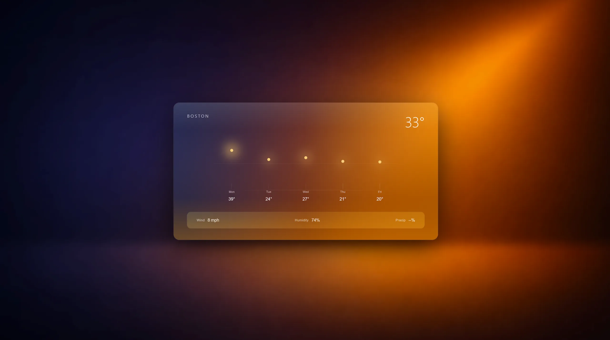

# Stratos

---

## Overview

Stratos is a lightweight weather interface focused on clarity scale and motion.  
It presents current conditions and short-range forecasts through a glass-based UI designed for quick reading and ambient awareness.

[View](https://stratos.vmoreira.dev)

---

## Presentation

- Emphasis on readability over density  
- Glass surfaces and layered depth  
- Smooth transitions between states  
- Information grouped by visual hierarchy  
- Designed to be glanced at not studied  

---

## Stack

- Next.js  
- TypeScript  
- Tailwind CSS  
- OpenWeather API  
