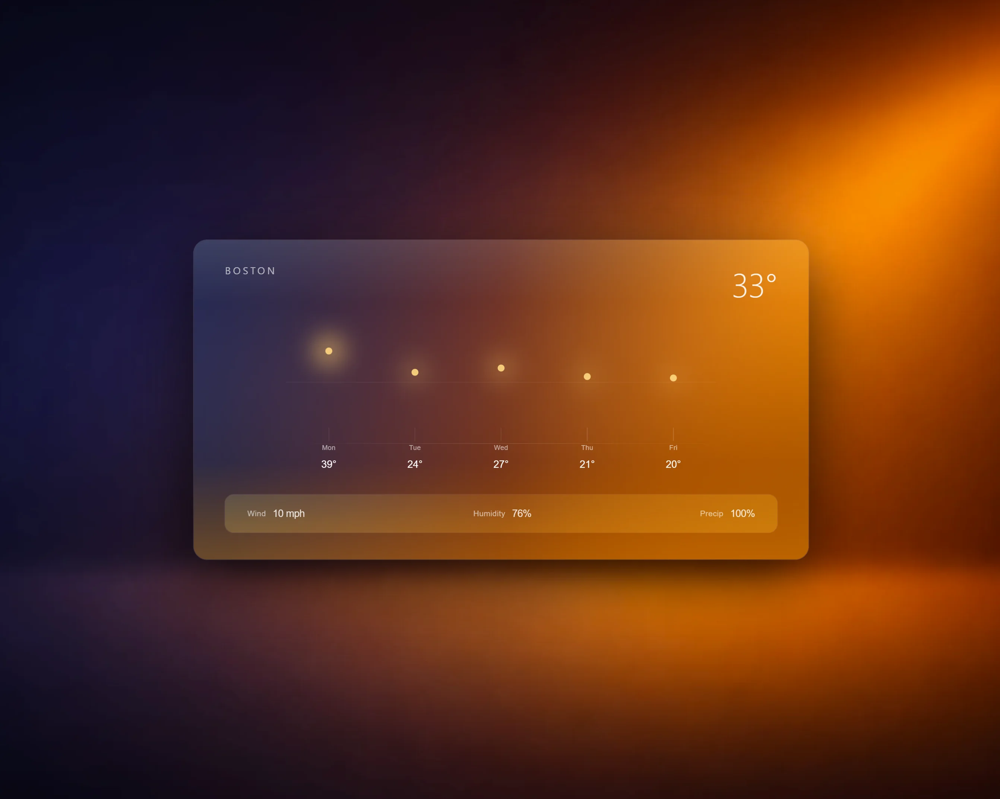

# Stratos

---

## Overview

Stratos is a lightweight weather interface focused on clarity, scale, and motion.

[Live Demo](https://stratos.vmoreira.dev)

---

## Design

- Warm-to-cool gradient background with a soft glow
- A single glass panel floats above the background
- Large temperature reading with minimal supporting details

---

## Stack

- Next.js
- React
- TypeScript
- Tailwind CSS
- OpenWeather API

